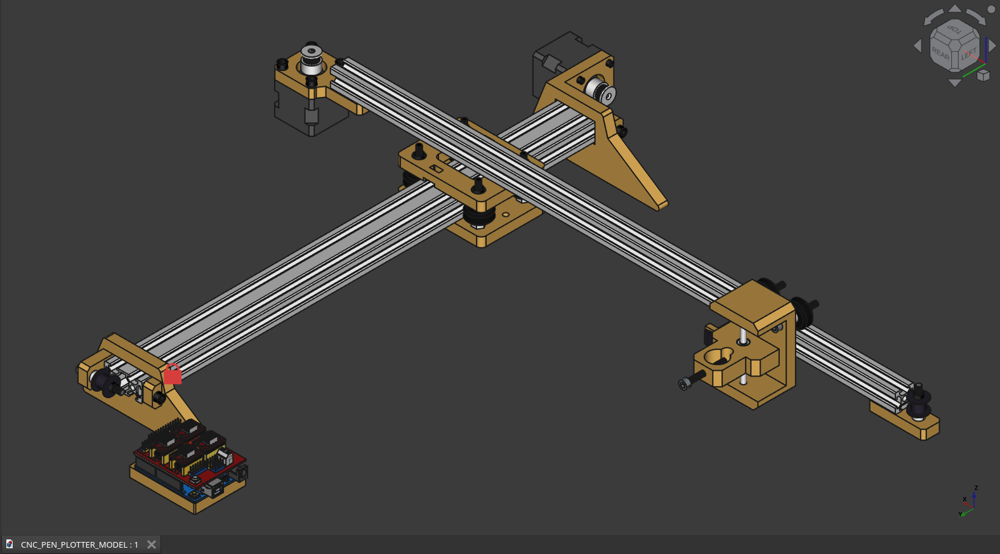

# PenPlotter_Uno


A DIY CoreXY pen plotter built from scratch | aluminum extrusion frame, V-wheel motion system, GRBL-controlled. Designed for pen-on-paper vector plotting.


---

## Overview

This plotter uses a CoreXY motion system where both motors move simultaneously to control the X and Y axes, keeping the pen carriage lightweight and fast. The frame is built from 2020 aluminum extrusion, with V-wheels running on the extrusion slots for smooth linear motion.

The design is intentionally simple — structural parts can be cut from **wood** or **3D printed** (see `/cad/`).



---

## Bill of Materials

### Electronics

| Component | Qty |
|---|---|
| Arduino UNO R3 | 1 |
| CNC Shield + 4 Stepper Driver (A4988) | 1 |
| NEMA17HS3401 | 2 |
| MG90 Servo | 1 |
| DC Adapter 12V 2A | 1 |

### Motion System

| Component | Qty |
|---|---|
| GT2 W10 Timing Belt | 2m |
| GT2 Timing Pulley (toothed) | 2 |
| GT2 Idler Pulley (toothless) | 2 |
| V Wheel 625ZZ | 7 |
| Eccentric Spacer M5 6mm | 3 |
| Aluminium Spacer 6mm | 10 |
| LM5UU Linear Motion Bearing | 1 |
| Aluminium Rod 80mm | 1 |

### Frame & Hardware

| Component | Qty |
|---|---|
| T Nut M5 2020 | 10 |
| Allen Screw M5 40mm | 6 |
| Allen Screw M5 50mm | 4 |
| Allen Screw M5 16mm | 10 |
| Hex Nut M5 | 9 |
| Screw 2.5mm | 2 |
| Allen Screw M3 15mm | 8 |
| Hex Nut M3 | 6 |

### Structural Parts

| Component | Notes |
|---|---|
| Wood / 3D Prints | See `/cad/` for source files |


## Firmware

This plotter runs [GRBL](https://github.com/gnea/grbl) flashed to the Arduino UNO. Key settings to calibrate after assembly:

```
$100 = [steps/mm X]   ; depends on pulley teeth & microstepping
$101 = [steps/mm Y]
$110 = [max feed rate X]
$111 = [max feed rate Y]
$120 = [acceleration X]
$121 = [acceleration Y]
```

Microstepping is configured via jumpers on the CNC Shield. Default: 1/16 step.

---

## Build Status

- [x] CAD model designed (FreeCAD)
- [x] BOM finalized
- [ ] Frame cut and assembled
- [ ] Electronics wired
- [ ] GRBL tuned and calibrated
- [ ] First plot

---

## License

Hardware design files: [CERN-OHL-S v2](https://ohwr.org/cern_ohl_s_v2.txt)  
Software/scripts: MIT

---

nimugen
